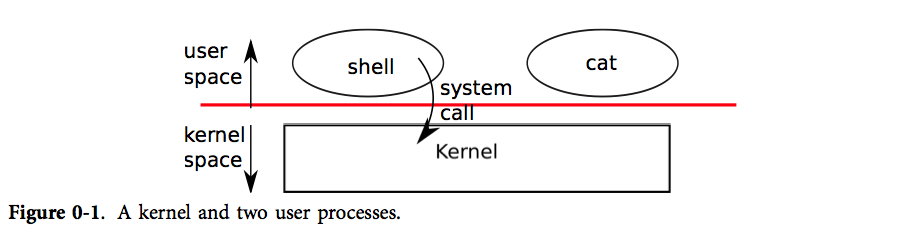

# 操作系统接口

什么是操作系统接口?

它是系统调用。进程通过系统调用使用内核服务，系统调用进入内核，让内核执行服务然后返回。



# 进程

那什么是进程？

狭义的说就是运行中的程序，当我们的用户程序运行时就是一个进程，比如sleep程序。

关于进程

- 进程分为两个部分，其一，用户内存空间（指令，数据，栈）；其二，仅对内核可见的进程状态。
- 内核将每一个进程和一个pid关联起来。
- 进程在xv6中是分时进行的，也就是这个进程执行一会，那个进程执行一会；

# 系统调用

1. fork
2. wait
3. exec

这都是书上介绍的调用，为什么介绍这三者，我想和下面要说的I/O重定向有关系，这里不作赘。

# I/O重定向

重定向是怎么实现的呢？

是通过[文件描述符] : https : 每个进程都有从0开始的文件描述符空间，进程从0读取输入，从1写输出，从2写错误。通过这个惯例来实现重定向。

```
char *argv[2];
argv[0] = "cat";
### argv[1] = 0;
if(fork() == 0) {
    close(0);
    open("input.txt", O_RDONLY);
    exec("cat", argv);
}
```

这段代码的意思是，当你使用了fork后，子进程释放关闭文件描述符0，然后open系统调用函数需要给input.txt给一个文件描述符，因为0是最小的，所以0就是input.txt的文件描述符。以后都会从input.txt读取输入了。

# 管道

什么是管道呢？

管道是一个小的内核缓冲区，它以文件描述符对的形式提供给进程，一个用于写操作，一个用于读操作。从管道的一端写的数据可以从管道的另一端读取。管道提供了一种进程间交互的方式。

在次我有必要提一下文件描述符，上面对文件描述符的描述是绝对正确的

来看一下这段代码

```
int p[2];
char *argv[2];
argv[0] = "wc";
argv[1] = 0;
pipe(p);
if(fork() == 0) {
    close(0);
    dup(p[0]);
    close(p[0]);
    close(p[1]);
    exec("/bin/wc", argv);
} else {
    write(p[1], "hello world\n", 12);
    close(p[0]);
    close(p[1]);
}
```

可以看到这个管道连接了两个进程，父进程在管道的写端口写入了hello world;

在子进程中，我们将子进程的0先释放，后调用dup系统调用将管道的读端口绑定给了子进程的0，在执行wc的时候，wc对应的进程从0读取，刚好读到在写端口传入的hello world;

上面的代码可以打包成这样

> echo hello world | wc

‘|’的前面是写端口，后面是读端口，echo将这12个字符写到管道，然后wc从管道中读出。

# 文件系统

xv6 文件系统提供文件和目录，文件就是一个简单的字节数组，而目录包含指向文件和其他目录的引用。

```
chdir("/a");
chdir("b");
open("c", O_RDONLY);

open("/a/b/c", O_RDONLY);
```

两个代码端打开的文件是一样的；

有很多的系统调用可以创建一个新的文件或者目录

```
mkdir("/dir");
fd = open("/dir/file", O_CREATE|O_WRONGLY);
close(fd);
mknod("/console", 1, 1);
```

这里需要注意mknod比较特别：`mknod` 在文件系统中创建一个文件，但是这个文件没有任何内容。相反，这个文件的元信息标志它是一个设备文件，并且记录主设备号和辅设备号（`mknod` 的两个参数），这两个设备号唯一确定一个内核设备。当一个进程之后打开这个文件的时候，内核将读、写的系统调用转发到内核设备的实现上，而不是传递给文件系统。

`fstat` 可以获取一个文件描述符指向的文件的信息

文件名和这个文件本身是有很大的区别。什么意思呢，就是说一个文件它可能会有很多文件名，但文件只有一个。这种情况称为链接（links),同样通过link命令，可以给文件起不同的名字。

```
open("a", O_CREATE|O_WRONGLY);
link("a", "b");
```

现在对a,b使用fstat，会发现ab指向同样的内容。

有了link创建文件名，同样可以通过unlink删除文件名，要彻底删除文件，只有链接数变为0才能彻底删除。

unlink(b),通过a,任然可访问。

另外思考一个问题

```
fd = open("/tmp/xyz", O_CREATE|O_RDWR);
unlink("/tmp/xyz")
```

这个文件被彻底删除了吗？

答案是如果进程没有结束或者fd没有被close就没有别彻底删除。

我们常用的cd呢？

cd是在shell中实现的，他的工作是在子进程中的，父进程中目录实际上是没有发生改变的。
